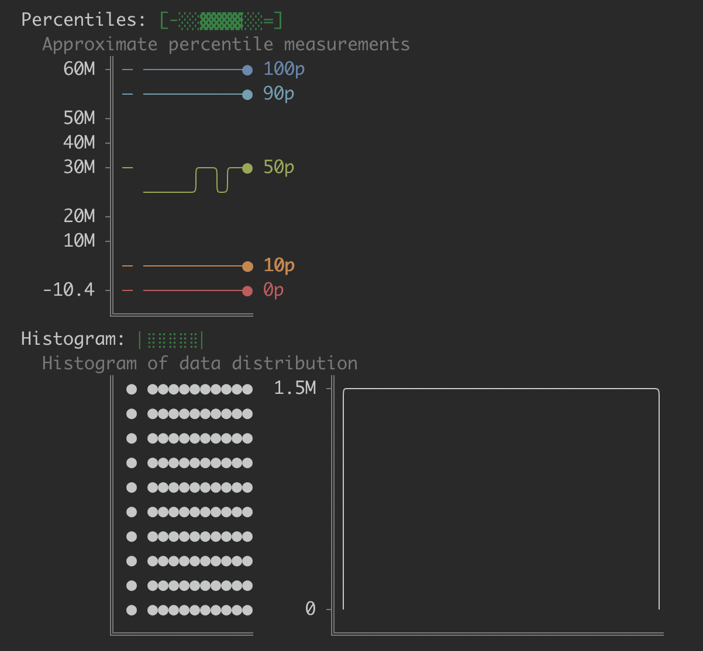

# Data Axolotl

[](https://pypi.org/project/data-axolotl)
[](https://pypi.org/project/data-axolotl)

Data Axolotl is a data monitoring tool for catching unexpected breaking changes in analytics data sets. Unlike other tools, which require you to know in advance what might break, Data Axolotl intelligenlty monitors _eveything_ by default.

Data Axolotl has a simple api, and works with Airflow or cron. Run Data Axolotl daily and send a summary of changes straight to Slack!


### What kind of issues does Data Axolotl monitor for?
- **Uniqueness**  A column used to be filled with unique values and now contains duplicates? You might want to know.
- **Distinct Count**  A three-valued enum now has four values? Let's check that.
- **Numeric Range**  The maximum date went from today to 2399-03-14? Oh no.
- **Schema Changes**  Someone removed a column but didn't tell you? Data Axolotl will.
- **Table Size**  Your 100 byte table is not 100 megabytes? Alert!
- ...and [much more](#list-of-metrics).

### What is Data Axolotl not?
- **Not** a test suite.
- **Not** for monitoring business metrics, like Signup Rates or CAC.
- **Not** a statistical analysis tool.

### Why Data Axolotl?
- **Monitor Everything Automatically**  Writing tests is great (keep it up!) but you can only test what you think to test for.
- **Track Historical State**  If you just noticed a table growing unexpectedly, but don't know when it started, a simple `data-axolotl report [table]` can show you historical trends and help you pinpoint issues.
- **Simple Setup**  Don't waste time configuring metrics. You can run your first monitoring job locally in minutes, and setting up a full production schedule doesn't take much longer.
- **On Prem**  Run Data Axolotl on your own infra. You shouldn't need to vet a new cloud provider just to monitor your data.



-----

# Usage
The simplest way to try out Data Axolotl is from your local computer via the cli command. For production deployments, see the [Usage via API](#usage-via-api) guide below.


## Locally
1. First, install data-axolotl via pip. (You can also install Data Axolotl inside a [virtual environment](https://docs.python.org/3/tutorial/venv.html))

```sh
pip install data-axolotl
```

2. Verify it was installed successfully by running
```sh
data-axolotl --version
```

3. Create your configuration by following the [Configuration section](#configuration) below, or alternatively, run `data-axolotl run` to let the interactive setup helper walk you through setup.

4. Run your first monitoring job
```sh
data-axolotl run
```

5. Wait a bit for data to change, then run again.
```sh
data-axolotl run
```

6. View your first report
```sh
# you can view only alerts using
data-axolotl alerts
# include --all to show all levels of alerts, including unchanged metrics.
data-axolotl alerts --all
# to view historical data, run
data-axolotl history
# you can also filter for a specific table
data-axolotl history database.schema.table
```

The first report may over-alert, since Data Axolotl hasn't yet learned what "normal" looks like for your data, but fasle positives should decrease once you've built up a larger history.

## Via API
A number of commands are available to run directly from python, facilitating use via Airflow or other tools.

```py
# Perform a run using the specified config. You can provide either a path
# to the config, or the config values in the form of a dictionary.
def run(config: Path | Dict)

# Get information about past runs
def list_runs(config: Path | Dict) -> List[Run]

# Remove a past run
def rm_run(config: Path | Dict, run_id: int)

# Get a list of alerts from a run
def get_alerts(
    config: Path | Dict,

    # Target can be used to provide a list of filters. These work the same way
    # as the config's `include`
    target: Optional[List[str]] = None,

    # If you don't specify a run id, the latest successful run is used
    run_id: Optional[int] = None,

    # Which levels of alerts you want to receive.
    # Available levels are: Major, Minor, Changed, Unchanged.
    level: Set[AlertSeverity] = { 'Major', 'Minor' },
) -> List[MetricAlert]
```

# Configuration
When run as a cli command, Data Axolotl reads its configuration from a config file. The default config location is `config.yaml` in the current working directory. You can also specify a config file via the cli `--config-path [path]` argument.

When running via the python api, such as with airflow, you can pass the same values in as a dictionary.

A description of config.yaml is below.

Note that Data Axolotl performs env var substitution on the config.yaml, so you can always pass in sensitive details via environment variables. Ex: `password: $SNOWFLAKE_PASSWORD`. (Substitution is not performed when calling via the python api.)

```yaml
# config.yaml
---
# The maximum number of queries data-axolotl will run in parallel. Default 10.
max_threads: 10

# The timeout of the entire run. Default 600 (10 minutes).
run_timeout_seconds: 600

# The default timeout per connection. Can be overridden in any individual connection. Default 600 (10 minutes).
connection_timeout_seconds: 600

# The default timeout per query. Can be overridden at the connection level. Default 60.
query_timeout_seconds: 60

# expensive queries are `string_avg_length` and `distinct_count`
exclude_expensive_queries: false

# complex queries are `numeric_percentiles` and `numeric_histogram` and `datetime_histogram`
exclude_complex_queries: false

# Connections point to the dbs you want to monitor
connections:
  # connection name; this can be any string you want.
  my_analytics_db:
    # currently must be snowflake
    type: snowflake

    # params is a dictionary of options passed to the connect api, and is
    # dependent on the connection type. See Connection Params below.
    params:
      - account: SDR632-AFH753
      - user: monitoring-user
      - warehouse: compute-1
      - password: $SNOWFLAKE_PASSWORD

    # include and exclude specify which objects Data Axolotl will monitor.
    # By default, Data Axolotl monitors all objects (excluding system objects).
    # You can list objects in the following formats:
    # - database
    # - database.schema
    # - database.schema.table
    # - database.schema.table:metric-name  # a specific table-level metric
    # - database.schema.table.column
    # - database.schema.table.column:metric-name  # a specific column-level metric
    include:
      - template_data
    exclude:
      - template_data.public

    # You can also include any of the top level config options to override them
    # per connection.

    # connection_timeout_seconds: 600
    # query_timeout_seconds: 60
    # exclude_expensive_queries: false
    # exclude_complex_queries: false

# How state is stored. Default is to store state via sqlite at `./local.db`.
# See State Storage below for details.
# To provide a local file:
# state: local.db
# To point to a table in a connected database:
state:
  connection: my_analytics_db
  prefix: analytics.data-axolotl  # data-axolotl will create its state tables here
```

## Connection Params
Each type of connection takes a different set of `params`, specific to that type of database.

### Snowflake
For Snowflake, all possible options are listed in [the developer guide](https://docs.snowflake.com/en/developer-guide/python-connector/python-connector-api#label-snowflake-connector-methods-connect)

Regardless of connection method, you probably want these params:
```yaml
# Snowflake Account Identifier. See https://docs.snowflake.com/en/developer-guide/python-connector/python-connector-api#label-account-format-info
account: <your account>

# User
user: <your user>

# Warehouse. Optional if your user has a default warehouse assigned in Snowflake
warehouse: <your warehouse>
```

Depending on your authentication method, add one of the below sets of parameters.

For private key authentication:
```yaml
private_key_file: "~/.ssh/rsa_key_snowflake.p8"
private_key_file_pwd: "<private key passphrase>"  # optional
```

For password authentication:
```yaml
password: "<your password>"
```

### Other Databases
Unfortunately, Data Axolotl only supports Snowflake (for now). If you have another database type you want support for, open an issue!

## State Storage
By default, Data Axolotl stores its state in a local SQLite database, located at `./local.db`. State is used to record history and generate alerts by tracking changes between runs. You can override where state is stored via the [config](#configuration).

A common pattern is to store state alongside the data you're monitoring, in a dedicated `data-axolotl` schema. An example of this is shown in the [configuration section](#configuration).

If you want to store state in a connection you don't monitor, for instance to use a different database type or connection params, see the example below.

```yaml
connections:
  monitored_db:
    ...
  state_db:
    type: snowflake
    params: {...}
    include: []  # don't monitor anything
state:
  connection: state_db
  prefix: db.data_axolotl
```

For production deployments, it's often useful to have a local config pointing at your production state db. That way, you can run `data-axolotl history` locally, but view production metrics. Your local connection could also use a read-only role for added safety.


# Reading Alerts
You can run `data-axolotl alerts` to get a list of alerts: what changed between this run and the last. By default, this command only shows Major and Minor alerts. You can pass `--changed` to include all changes, or `--all` to explicitly list unchanged metrics as well.

Take this example of some alerts from the `dim_user` table.
```
  Dim_User (MART.CORE.DIM_USER):
    - Row Count:                       6,510 → 6,510              (==,Δ=0z)
    Number_Of_Notes (NUMBER_OF_NOTES):
      - Percentiles:            [░=--      ] → [░=--      ]       (Δ=0.04z)
    Friend_Count (FRIEND_COUNT):
      - Maximum:                         120 → 124                (Δ=0.4z)
```
The first section lists table-level alerts (like Row Count), which is then followed by alerts for specific columns.

Each alert shows:
* The metric it's using
* The previous value
* The new value
* The alerting strategy and change amount

## Alerting Strategies
Data Axolotl employs a few different alerting strategies depending on the metric type and available historical data.

- **Binary Changed/Unchanged `(==)`, `(!=)`**  The simplest strategy used for metric that we don't expect to change, e.g. column type.
- **Tracked Status**  When we first see a table/column, or when a table/column goes away.
- **Delta Standard Deviations `(Δ=1.2z)`**  Compares the amount this value _changed_ to the distribution of previous changes, in units of standard deviation.
    - For example:
        - Let's say that historically, row count increases by an average of 200 per run, with a standard deviation of 10.
        - This run, row count increased by 205.
        - That would be `Δ=0.5z`, a statistically common event.
    - Note that this is looking at historical _changes_, not historical values, effectively monitoring the derivative of the metric.
- **Percentage Changed `(+5%)`**  How much this value changed relative to the previous value. `(current - previous) / previous`. Used when there isn't enough data to get a statistical change value.

# Reading Metrics


## List of Metrics

| Metric              | Name                  | Level             | Description |
| ------------------- | --------------------- | ----------------- | ----------- |
| Bytes               | `bytes`               | table             | Size of the table. |
| Row Count           | `row_count`           | table             | Number of rows. |
| Created At          | `created_at`          | table             | When the table was created. |
| Altered At          | `altered_at`          | table             | When the table's schema was last altered. |
| Updated At          | `updated_at`          | table             | When the table's data was last updated. |
| Staleness           | `staleness_hours`     | table             | How recently the table's data was updated. Equal to `run time - updated_at`. |
| Data Type           | `data_type`           | column            | The column's type, as listed in the database. |
| Data Type Simple    | `data_type_simple`    | column            | The simplified type: number, string, boolean, etc. |
| Distinct Count      | `distinct_count`      | column            | How many distinct values there are. May be an approximation for large tables. |
| Distinct Rate       | `distinct_rate`       | column            | What percentage of the column is distinct. `Distinct count / non-null count`. May be an approximation for large tables. |
| Null Count          | `null_count`          | column            | Number of null rows. |
| Null Pct            | `null_pct`            | column            | What percentage of the column is null. `null count / row count`. |
| True Count          | `true_count`          | column (boolean)  | What percentage of the column is true. `true count / non-null count`. |
| False Count         | `false_count`         | column (boolean)  | What percentage of the column is false. `false count / non-null count`. |
| Numeric Min         | `numeric_min`         | column (numeric)  | Min of values, ignoring nulls. |
| Numeric Max         | `numeric_max`         | column (numeric)  | Max of values, ignoring nulls. |
| Numeric Mean        | `numeric_mean`        | column (numeric)  | Mean of values, ignoring nulls. |
| Numeric Stddev      | `numeric_stddev`      | column (numeric)  | Standard Deviation of values, ignoring nulls. |
| Numeric Percentiles | `numeric_percentiles` | column (numeric)  | Approximate percentile measurements. |
| Numeric Histogram   | `numeric_histogram`   | column (numeric)  | Distribution of values, auto-bucketed. |
| String Avg Length   | `string_avg_length`   | column (string)   | Average length of string. |
| Datetime Max        | `datetime_max`        | column (datetime) | Max of values, ignoring nulls. |
| Datetime Min        | `datetime_min`        | column (datetime) | Min of values, ignoring nulls. |
| Datetime Histogram  | `datetime_histogram`  | column (datetime) | Distribution of values, auto-bucketed by either day, week, month, or year. |


# Development
Most users of data-axolotl won't need to follow the steps in this section. For only using Data Axolotl, just follow the guides above. However, if you're looking to make changes or contribute code, follow the guide below.

Data Axolotl manages its dev environment with [Hatch](https://hatch.pypa.io/). Follow their [installation guide](https://hatch.pypa.io/latest/install/) to get it set up on your system.

Once hatch is installed, you can run data-axolotl as follows.

```sh
hatch run data-axolotl [args]
```

You can add dependencies in `pyproject.toml`, which will be auto installed whenever you do `hatch run`.


# License
`data-axolotl` is distributed under the terms of the [MIT](https://spdx.org/licenses/MIT.html) license.
